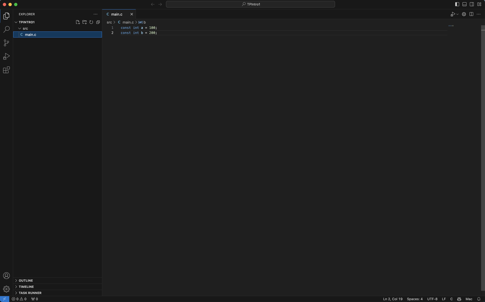
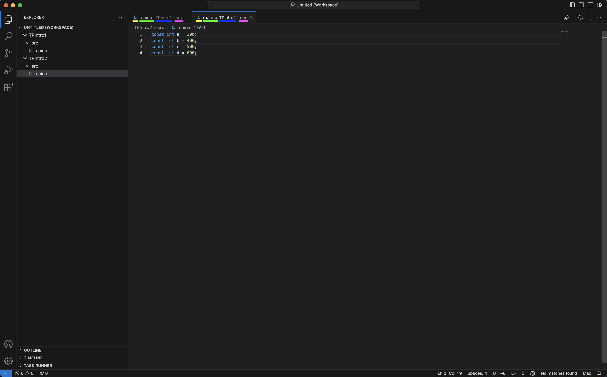
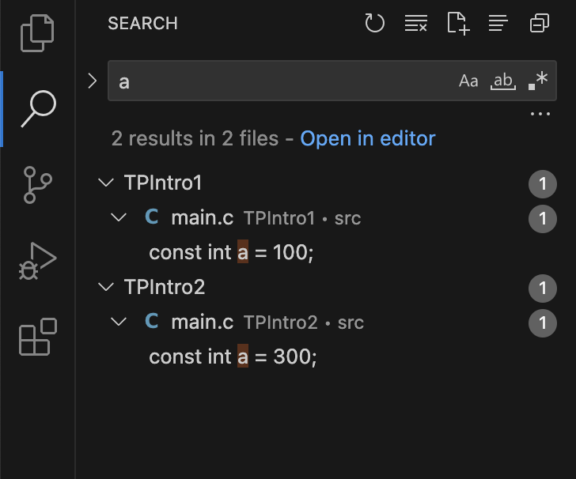
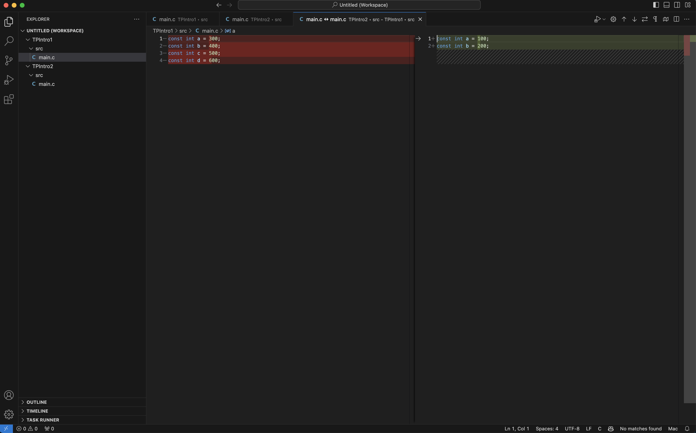
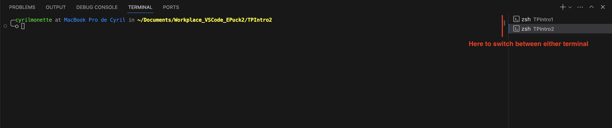
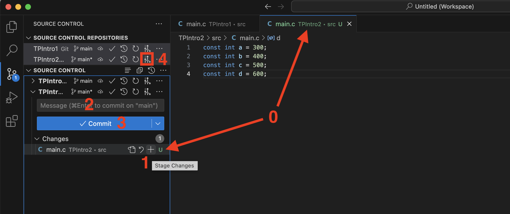
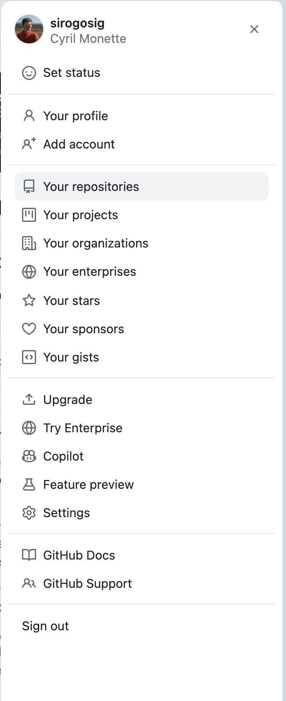
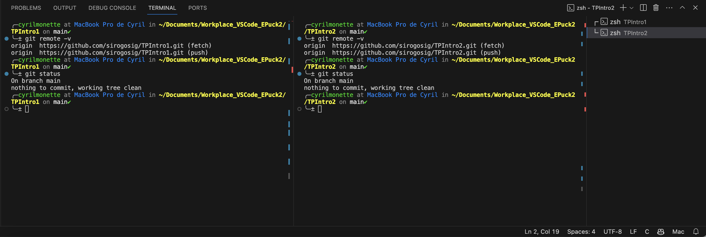
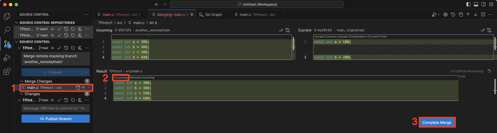
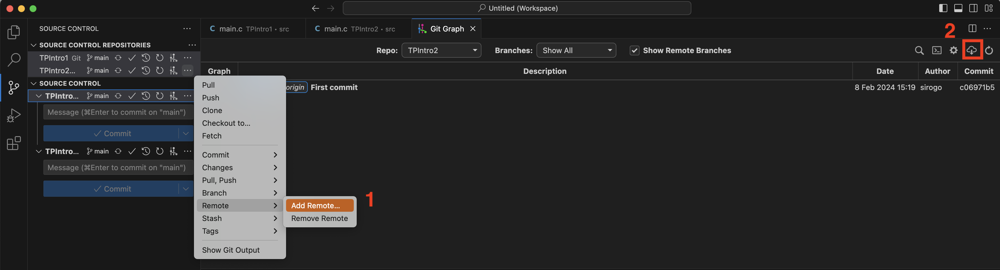

# Introduction
Welcome to the very first lab of MICRO-315. As explained in class, labs take place every Thursday from 8.15am to 1pm, and we strongly advice you to make the best use of those hours are those are the only ones where you can get help from assistants ! Feel free do to labs with your project teammate or on your own, as preferred. To ask questions, follow the instructions on the [moodle page of the class](https://moodle.epfl.ch/course/view.php?id=467).

- `⏱ Duration`: 3 hours
## Goals
- The main goal is to present the tools that will be used throughought every labs of this semester to program and debug the e-puck2 robot;
- The second goal is to gain knowledge of the STM32F4 microcontroller and refresh some concepts about peripherals such as GPIOs and TIMERs.
- All in all, this practical work shows all the necessary steps to program the e-puck2 miniature mobile robot in C, using the standard library provided by ST.

## Methodology
To achieve the main goal, we will go through the following steps:
  - Getting familiar with the IDE (Integrated Development Environment): [Part 1](#part-1---integrated-development-environment-ide)
  - Getting familiar with python environments and pyenv specifically [Part 2](#part-2---pyenv)
  - Getting familiar with e-puck2 robot: [Part 3](#part-3---presenting-the-epuck2-robot)
  - Understand the basic of the version control tool *Git*, **MANDATORY** for this course: [Part 4](#part-4---git-introduction)
  - Setup the git repository for your group: [Part 5](#part-5---setting-up-your-group-tps-repository)
  - Getting used to program an e-puck2: use the on board debugger interface for programming and debugging [Part 6](#part-6---tutorial-for-programming-the-epuck2-robot)
  
To install the IDE and tools used in the labs, click on one the links accordingly to your computer's configuration here below and follow the instructions. If you encounter issues with the installation, please ask a question using the link on the [moodle](https://moodle.epfl.ch/course/view.php?id=467).

- 👉 [🍎 MacOS](https://github.com/EPFL-MICRO-315/TPs-Student/wiki/Installing-the-IDE-%F0%9F%8D%8E-MacOS)
- 👉 [❖ Windows](https://github.com/EPFL-MICRO-315/TPs-Student/wiki/Installing-the-IDE-%E2%9D%96-Windows)
- 👉 [🐧 Linux](https://github.com/EPFL-MICRO-315/TPs-Student/wiki/Installing-the-IDE-%F0%9F%90%A7-Linux)


# Part 1 - Integrated Development Environment (IDE)
The IDE now freshly installed, let's start by learning how to navigate the IDE and how to make use of it for coding.

## 1.1 Base VSCode
If you are already experienced with VSCode as an IDE, feel free to skip this section and continue towards [Part 1.2](#12-tools-used-throughout-the-labs).

Before diving into practical excercises, please give a thorough read to the wiki page of the IDE that contains most of what you need to know to complete the following exercises: 
- 👉 [🗔 User Interface](https://github.com/EPFL-MICRO-315/TPs-Student/wiki/IDE-%F0%9F%97%94-User-Interface)

Make two new folders called `TPIntro1` and `TPIntro2` in the workplace locally on your computer, next to Lib. If you're not sure where the workplace is, read your the wiki page of the installation for your type of OS, as referenced at the end of [Methodology](#methodology). Open `TPIntro1` on VSCode Epuck2 and by rightclicking on the explorer tab, create a src document that cotains a `main.c` file as shown below.

<p float="left">
    
</p>

Next we will open a VSCode Workspace, which is nothing more than a collection of folders opened within one window. This enables to easily work on multiple projects and individually compare each file within those. Right click on the explorer tab and click *Add folder to workspace*, then select `TPIntro2`. Fill `TPIntro2` similarly to `TPIntro1` to end up as follows:

<p float="left">
    
</p>

Notice that opened tabs are systematically referenced as follows:
- <font color="yellow">File type (.c, .py, .ipynb, etc.)</font>
- <font color="lime">File name including extension</font>
- <font color="blue">Folder within workspace</font>
- <font color="fuchsia">Subfolder(s)</font>

One of the advantages of VSCode is the advanced search tool. By pressing `Cmd + Shift + f` or by navigating to the search menu, try and search for the `a` variable and notice how the search tool references all variables found throughout the workspace.

<p float="left">
    
</p>

Another advantage of VSCode workplaces is the easy and fast comparison it enables between files of different folders. Select both `main.c` files in either folder, then right-click on either file and go for *compare selected*. This will open a new tab that presents the differences between both files, which will later be extensively used for comparing large codes with each other. Watch out that the order in which you select the files will affect the left/right position of the latter in the comparison tool.

<p float="left">
    
</p>

## 1.2 Tools used throughout the labs
For the purpose of this lab, and to facilitate the programming of the e-puck2 robot, additionnal tools have been set up during the installation.Please get familiar with those tools, including VSCode extensions by reading through the wiki:
- 👉 [🛠 Tools](https://github.com/EPFL-MICRO-315/TPs-Student/wiki/IDE-%F0%9F%9B%A0-Tools)


# Part 2 - Pyenv
Some labs will require the execution of python scripts, which you may in fact also be interested to develop for your own miniproject. For this purpose, the labs make use of Pyenv (MacOS and Linux) or Pyenv-win (Windows) to facilitate python executions use without disturbing other python projects you may have on your computer. Please read through the wiki of Pyenv before going on to ensure you understand the basics of this tool.

As explained in the wiki, pyenv not only enables us to switch python versions but also keep python modules specific to one project, rather than system-wide. To test this, open a terminal on VSCode Epuck2 by pressing `Cmd + Shift + P` and execute the `Terminal: Create New Terminal` command. Select `TPIntro1` as root for the terminal, and do it all again for `TPIntro2` to end up with two terminal windows.

<p float="left">
    
</p>

Now we will create specific environments based on two different python versions for those two folders. In one of the two terminals just created, type the following:

```shell
pyenv install 3.9.0 # intall python 3.9.0 ready to use
pyenv install 3.10.0 # intall python 3.10.0 ready to use
pyenv virtualenv 3.9.0 TPIntro1-env # Create a pyenv environment 
pyenv virtualenv 3.10.0 TPIntro2-env # Create another pyenv environment 
```

Then, in each terminal, execute the following commands by replacing `X` by the folder number (1 or 2).

```shell
pyenv local TPIntroX-env # Links the pyenv environment to the folder
python --version # prints out python version
```

The second command should print `3.9.0` for terminal 1 and `3.9.10` for terminal 2. This shows that pyenv has effectively changed the python version between both terminals, and that you're well able to use different python version in different projects.
Now, open an external terminal (not internal to VSCode) and travel to your WorkplaceEPuck2 using `cd`. You should observe the following:

```shell
$ cd ..
$ python --version
your system wide python
$ python --version
3.11.2 # NEEDS FINAL WORKPLACE VERSION HERE
$ cd TPIntro1
$ python --version
3.9.0
$ cd ../TPIntro2
$ python --version
3.10.0
```

This shows that while travelling between different folders, pyenv in fact dynamicalls changes the environment (and thus python version) !

# Part 3 - Presenting the EPuck2 robot
- 👉 [Presenting the EPuck2](https://github.com/EPFL-MICRO-315/TPs-Student/wiki/EPuck2-Presenting-the-EPuck2)
- 👉 [Testing the EPuck2](https://github.com/EPFL-MICRO-315/TPs-Student/wiki/EPuck2-Testing-the-EPuck2)

# Part 4 - Git introduction
Now that we're familiar with the IDE and the robot, there's a final step before we can start coding. As a means to facilitate the reviewing, testing, sharing and saving of code, many developers use a code versioning tool. For this course (i.e labs **and miniproject**), we've decided to make use of `git`, which is the most widely used versioning tool. Please read through the following wiki page to get familiar with the basic concepts of `git`.
- 👉 [Introduction to Git](https://github.com/EPFL-MICRO-315/TPs-Student/wiki/Git-Introduction-to-Git)

To experiment what we've just read, we'll again play with the two repositories created earlier. In the terminal `TPIntro1`, enter the following and observe what happens after each command in the git tab of the IDE (check out the IDE 👉 [🗔 User Interface](https://github.com/EPFL-MICRO-315/TPs-Student/wiki/IDE-%F0%9F%97%94-User-Interface) wiki page if needed).

```shell
$ git init # init git. This will typically create a .git folder locally
$ git status
On branch main

No commits yet

Untracked files:
  (use "git add <file>..." to include in what will be committed)
        src/

nothing added to commit but untracked files present (use "git add" to track)
$ git add src/ # add all files in src directory to the next commit
$ git commit -m "first commit" # commit
$ git status
On branch main
nothing to commit, working tree clean
```

Making a local git versioning of a piece of code can be done either through command line, as you've just done, or through the VSCode git plugin. To try out the latter approach, press `Cmd + Shift + P` to open the command palette tool, then execute the `Git: Initialize repository` command by selecting `TPIntro2` when prompted. You may notice that the src/ repository of `TPIntro2` turned green, and if you open the git tab of VSCode, you'll also notice that the green letter `U` appears next to `main.c`. This stands for `Untracked`, and embodies the fact that this file is not yet being tracked for by git: it is new and was never seen before by git (as indeed we just started git). Similarly to command line, press the `+` sign next to the file to add it to the next commit, enter a commit message then press `Commit`. Ensure that the commit is well visible in the git graph extension of VSCode (`4` in the picture below).

<p float="left">
    
</p>

Now that we've saved a local version of our code, we might want to share it with teammates to collaborate on a common piece of code. And this is where GitHub comes in handy, as it indeed enables the cloud storage of code that we can share with others through pulls, clones and pushes. If you're not familiar with this vocabulary, you're again encouraged to browse through the [git wiki](https://github.com/EPFL-MICRO-315/TPs-Student/wiki/Git-Introduction-to-Git#). We'll need a [Github](https://github.com) account to continue with the rest of the practicals, so make sure you have one before going on.

First, we'll create a remote repository on your GitHub profile. Anywhere on Github, click on your profile top left of the screen, then on *Your repositories*.

<p float="left">
    
</p>

Click on *New*, name the repository `TPIntro1`, decide whether to make it private or public then click *Create repository* without touching any other option. Now that the repository is created on the remote location (github.com in our case), we need to link our local code to it. Back on the VSCode terminal within `TPIntro1`, enter the following commands.

```shell
$ git remote -v # This command should show nothing as no link with any remote has yet been established
$ git remote add origin https://github.com/username/TPIntro1.git #replace username with your github username
$ git remote -v
origin  https://github.com/username/TPIntro1.git (fetch)
origin  https://github.com/username/TPIntro1.git (push)
$ git push origin --all # push all branches onto the origin remote
```

Now we've linked the `TPIntro1` local git project with one remote. You can refresh your browser page of github and confirm that your code is now available on there too. What you'll encounter in the labs is typically that local git projects are linked to several remotes, meaning that you can fetch from, pull from and push to different places in the cloud. To test this behaviour, we'll create a github repository for `TPIntro2` too.
Publishing local branches is typically easier to do with VSCode. In the git tab of VSCode, press `Publish branch`, then select whether to publish it as public or private to publish your branch in a newly created github repository. By comparing both terminals, you should have the same end result through either CLI or VSCode:

<p float="left">
    
</p>

Now we'll add the newly created remote repository for `TPIntro2` as second remote to our `TPIntro1` local repository. In the `TPIntro1` terminal session, execute the following:

```shell
$ git remote add another_remote https://github.com/sirogosig/TPIntro2.git
$ git remote -v # Take a look to ensure the change has been made
another_remote  https://github.com/sirogosig/TPIntro2.git (fetch)
another_remote  https://github.com/sirogosig/TPIntro2.git (push)
origin  https://github.com/sirogosig/TPIntro1.git (fetch)
origin  https://github.com/sirogosig/TPIntro1.git (push)
$ git fetch --all # fetch both remotes to have both indexes locally available
```

Now we can fetch and push to either remote, based on what we want to do. For instance, say we want to merge both repositories, we can execute:

```shell
$ git merge --allow-unrelated-histories remote2/main
```

which will ask us to resolve merge conficts, as indeed the same variables are being renamed in `TPIntro2`. In the confict editor, select to accept the incoming, then resolve the merge confict.

<p float="left">
    
</p>

You should end up with the same content in `TPIntro1` and `TPIntro2`, without having done any manual code edits. Confirm this by doing a VSCode comparisong between both files as seen in [part 1.1](#11-base-vscode).

Now we'll do the same for `TPIntro2` except through VSCode to test the differences. For this, select `add remote` from the three dots next to the `TPIntro2` source control (`1` in image below). Copy the url of your first remote (https://github.com/username/TPIntro1.git) then name it `another_remote`.

<p float="left">
    
</p>

Pressing `2` in the image above will fetch from all remotes and should make it visible that you've now linked to a second remote `another_remote`.
We are now finished with the two repositories `TPIntro1` and `TPIntro2`, and they can now be deleted locally and on github, unless you want to keep them for further experimentation.

# Part 5 - Setting up your group TP's repository
Now that we've experienced git on our own, it's time to use it on a real example: setting up your group repositories. The following wiki links should guide you through this process.
- Click 👉 [here](https://github.com/EPFL-MICRO-315/TPs-Student/wiki/Git-Setting-up-git-for-TPs) to set up git for the TPs
- Click 👉 [here](https://github.com/EPFL-MICRO-315/TPs-Student/wiki/Git-Working-in-groups) to learn how to work in group using Git
- Click 👉 [here](https://github.com/EPFL-MICRO-315/TPs-Student/wiki/Git-Asking-for-support) to check how to ask for support

You should now continue the lab by reading through this README.md opened on VSCode locally. To do this, open the `TPs` folder on VSCode and run the following command on the VSCode terminal:

```shell
git checkout TP_Intro # This will create a local version of the TPIntro branch on reference
git push origin TP_Intro --set-upstream
```

# Part 6 - Tutorial for programming the EPuck2 robot

## 6.0 🔌 Preparation 
- Open the folder `TPs` with VSCode Epuck2
- Make sure you are in the right branch (`TP_Intro`)
- Run the task `Link Library ST to workspace`

## 6.1 🔨 Building the Project
- Building the code consists of compiling the **\*.c** and **\*.s** files to create object files, **\*.o**, and then linking the object files to create the **blinky.elf** file
- More detail on the steps of the build process will be given during TP1
- The generated **.elf** file contains the data necessary to program the device and additional information that lets you debug at the source code level
- The additional files **.list**, **.size** and **.mem** are generated containing the disassembly output and the memory layout table with symbol address and size.
- 👉 To compile the project
  1. Run the task **TP Intro: Make**
  2. Observe the progress of the compilation in the Build Console tabular (as in Listing 1).
  3. When Done is displayed, your code is built and you are ready to program the device. If there are errors in your code, they will be displayed in this console.
      ```yml
      > Compiling gpio.c
      > Compiling main.c   
      ar> Compiling timer.c
      m-none-eabi> Compiling stm32f4xx_ll_rcc.c
      -gcc > Compiling system_clock_config.c
      -c -mcpu=cortex-m4 -O0 -ggdb -fomit-frame-pointer -falign-functions=16 -ffunction-sections -fdata-sections -fno-common -Wall -Wextra -Wundef -Wstrict-prototypes -DSTM32F4 -DSTM32F407xx -mthumb -mno-thumb-interwork -MD -MP -I. -I../ST gpio.c -o gpio.o
      > Compiling system_stm32f4xx.c   
      > Compiling startup_stm32f407xx.s
      arm-none-eabi-gcc -c -mcpu=cortex-m4 -O0 -ggdb -fomit-frame-pointer -falign-functions=16 -ffunction-sections -fdata-sections -fno-common -Wall -Wextra -Wundef -Wstrict-prototypes -DSTM32F4 -DSTM32F407xx -mthumb -mno-thumb-interwork -MD -MP -I. -I../ST main.c -o main.o
      arm-none-eabi-gcc -c -mcpu=cortex-m4 -O0 -ggdb -fomit-frame-pointer -falign-functions=16 -ffunction-sections -fdata-sections -fno-common -Wall -Wextra -Wundef -Wstrict-prototypes -DSTM32F4 -DSTM32F407xx -mthumb -mno-thumb-interwork -MD -MP -I. -I../ST timer.c -o timer.o
      arm-none-eabi-gcc -c -mcpu=cortex-m4 -O0 -ggdb -fomit-frame-pointer -falign-functions=16 -ffunction-sections -fdata-sections -fno-common -Wall -Wextra -Wundef -Wstrict-prototypes -DSTM32F4 -DSTM32F407xx -mthumb -mno-thumb-interwork -MD -MP -I. -I../ST ../ST/system_clock_config.c -o ../ST/system_clock_config.o
      arm-none-eabi-gcc -c -mcpu=cortex-m4 -O0 -ggdb -fomit-frame-pointer -falign-functions=16 -ffunction-sections -fdata-sections -fno-common -Wall -Wextra -Wundef -Wstrict-prototypes -DSTM32F4 -DSTM32F407xx -mthumb -mno-thumb-interwork -MD -MP -I. -I../ST ../ST/stm32f4xx_ll_rcc.c -o ../ST/stm32f4xx_ll_rcc.o
      arm-none-eabi-gcc -c -mcpu=cortex-m4 -O0 -ggdb -fomit-frame-pointer -falign-functions=16 -ffunction-sections -fdata-sections -fno-common -Wall -Wextra -Wundef -Wstrict-prototypes -DSTM32F4 -DSTM32F407xx -mthumb -mno-thumb-interwork -MD -MP -I. -I../ST ../ST/system_stm32f4xx.c -o ../ST/system_stm32f4xx.o
      arm-none-eabi-gcc -x assembler-with-cpp -c -mcpu=cortex-m4 -mthumb -mno-thumb-interwork -I. -I../ST ../ST/startup_stm32f407xx.s -o ../ST/startup_stm32f407xx.o
      > Linking blinky.elf
      arm-none-eabi-gcc main.o gpio.o timer.o ../ST/system_clock_config.o ../ST/stm32f4xx_ll_rcc.o ../ST/system_stm32f4xx.o ../ST/startup_stm32f407xx.o   -mcpu=cortex-m4 -O0 -ggdb -fomit-frame-pointer -falign-functions=16 -ffunction-sections -fdata-sections -fno-common -nostartfiles -L./ -mthumb -mno-thumb-interwork -Wl,--no-warn-mismatch,--gc-sections,--script=../ST/STM32F407VGTx_FLASH.ld  -o blinky.elf
      > Creating blinky.mem
      > Creating blinky.list
      > Creating blinky.size
      arm-none-eabi-nm --numeric-sort --print-size blinky.elf > blinky.mem
      arm-none-eabi-objdump -d blinky.elf > blinky.list
      arm-none-eabi-nm --size-sort --print-size blinky.elf > blinky.size
      arm-none-eabi-size blinky.elf
         text    data     bss     dec     hex filename
         1432       4    1540    2976     ba0 blinky.elf
      > Done
      ```
  > `Task 1`<br>
  > Try to find out the meaning of the words **text**, **data**, **bss**, **dec**.<br>
  > Estimate the size of your code in percentage of total Flash and RAM available with this microcontroller.

## 6.2 🐞 Programming and debugging the EPuck2 robot
- Now that you have built your code and created an **.elf** file that can be loaded on the microcontroller, you can program the device:
  - Plug the USB cable (no need to turn on the e-puck2 using the dedicated button since the programmer MCU will automatically power the main MCU) 
  - Specify the port to which the EPuck2's gdb-server is connected, click 👉 [here](https://github.com/EPFL-MICRO-315/TPs-Student/wiki/EPuck2-Communicating-with-the-EPuck2#identify-the-ports) for more info
  - Program the EPuck2 by clicking on `Run and Debug` tab (in the left side bar)
- 💡 click 👉 [here](https://github.com/EPFL-MICRO-315/TPs-Student/wiki/IDE-%F0%9F%90%9B-Debugging) for more info about programming and debugging

## 6.3 Testing your EPuck2
You may find it useful to test your EPuck2 at times when the code executed does not match your expectations. Let's jump into such a case and use another LED by uncommenting the `TEST_NEEDED` define in `main.h`, that will switch the led used to the `BODY_LED`. Build and upload the code, and notice that no LED is being triggered.

To ensure that the `BODY_LED` is working properly. To do this, read through the wiki section on how to test a robot using the EPuckMonitor. Follow both the demo program 1 and demo program 2.
- 👉 [Testing the EPuck2](https://github.com/EPFL-MICRO-315/TPs-Student/wiki/EPuck2-Testing-the-EPuck2#introduction)
